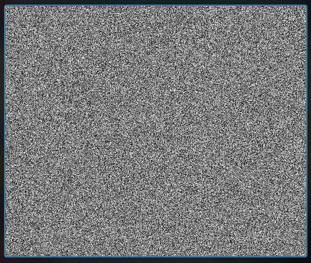
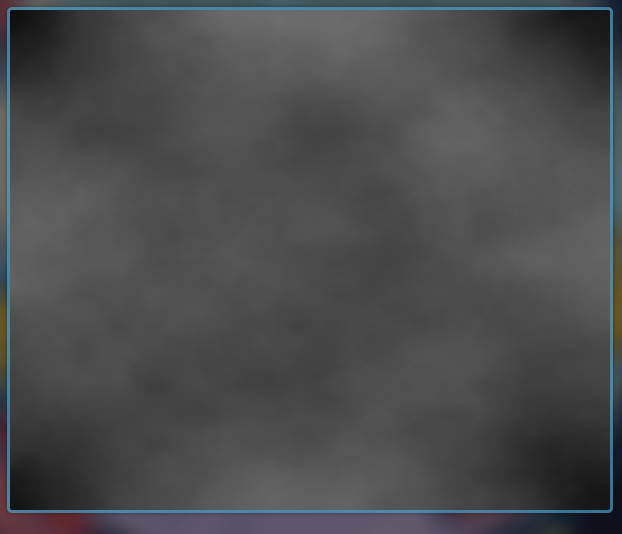
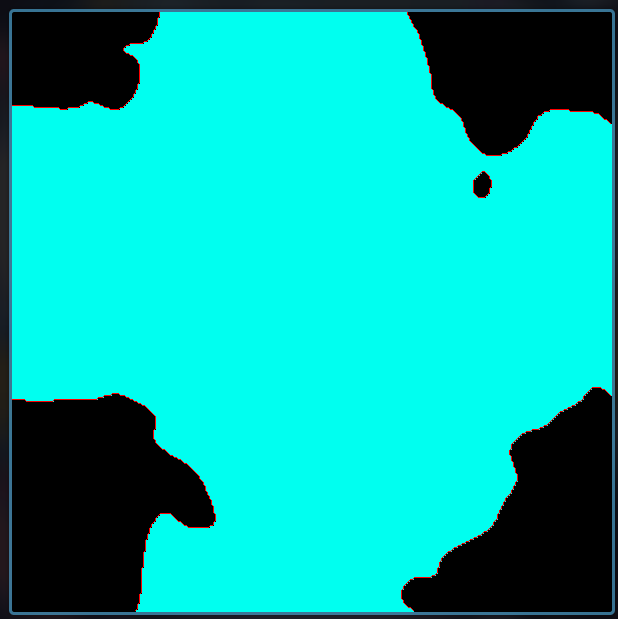

Generate height map using fractal noise function:

> Base noise for fractal noise function
> 
>
> noise step
>
> 

Draw contour lines with marching squares:

> 

Build:

> from project root

```
mkdir build && cd build
cmake ..
cmake --build .
```
